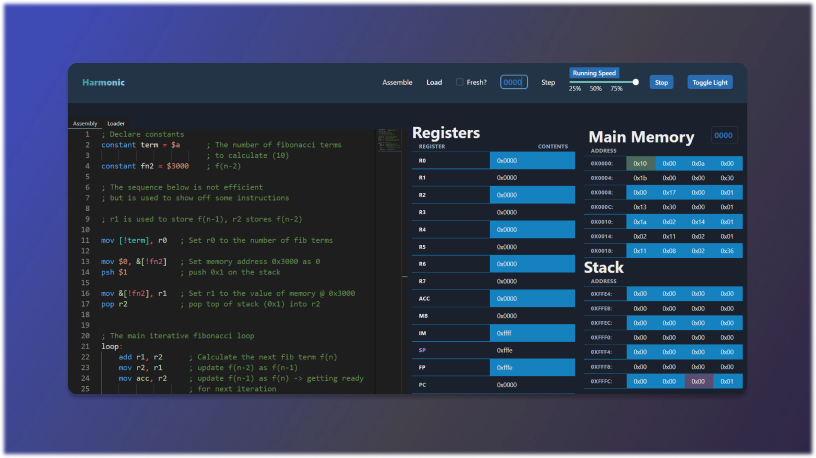
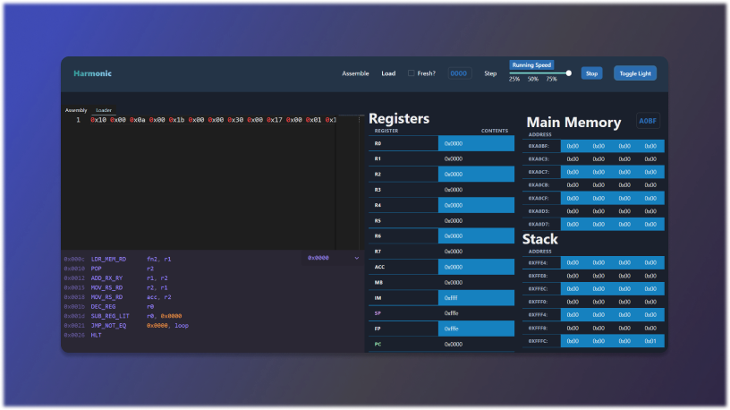
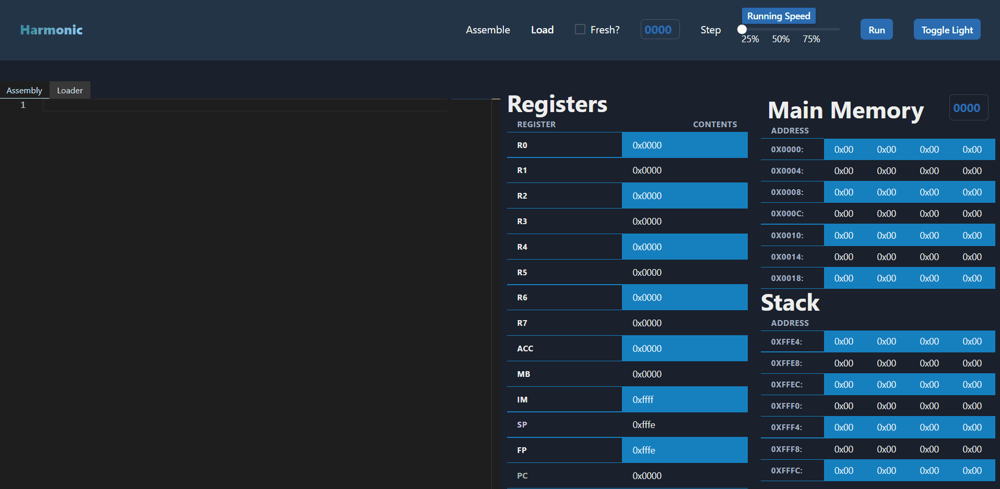

# HarmonicVM
> **HarmonicVM** is a simple implementation of a 16-bit virtual machine --- a processing unit that interfaces main memory to execute a set of instructions. The application consists of a byte-code that defines and executes a custom instruction set in addition to a frontend client that allows interfacing with the vm. The client features two editors: one for assembly, the other machine code, and the ability to load instruction into memory and step through execution. The client is accessible [here](https://yyassin.github.io/HarmonicVM/).

<span float="left" title="harmonic main page img">
 <p float="left">
  
  
 </p>
</span>

## Table of Contents
<!--ts-->
   * [Demo](#demo)
   * [Features](#features)
   * [Your First Program](#your-first-program)
   * [Next Steps](#next-steps)
   * [Documentation](#documentation)
      * [General Syntax](#general-syntax)
      * [Instruction Set Architecture](#instruction-set-architecture)
         * [Arithmetic](#arithmetic)
         * [Logical](#logical)
         * [Load and Store](#load-and-store)
         * [Jumps](#jumps)
         * [Other](#other)
   * [Credits](#credits)
      

<!--te-->

## Demo 
<span title="harmonic demo gif">
 <p align="left">
  
 </p>
</span>

## Features
Here are some of the features Harmonic boasts
- A custom byte-code vm that implements the instruction set architecture documented below.
- A parser(-combinator) that parses Harmonic assembly into the associated byte-code.
- On the frontend, we have
   - A tabbed-editor that supports writing Harmonic assembly and byte-code (if you're into that)     along with syntax highlighting.
   - Helpful... semi-helpful messages to identify syntax errors. 
   - Table views of internal machine state: specifically general purpose registers, main memory and the stack.
   - The ability to load machine code anywhere in main memory and begin execution: either step by step or continual running of the program (I suggest using the `hlt` instruction for the latter).

## Your First Program
To help you get started with using Harmonic, let's walk-through writing and loading the machine-code that implements a program to compute the nth fibonacci number. In our case, the 12th number.
1. First, head over to the Harmonic wesbite [here](https://yyassin.github.io/HarmonicVM/).
2. Copy the assembly code below into the "Assembly" tab then click the "Assemble" option in the menu.
3. The editor should switch to the "Loader" tab and display the binary string that represents the machine code of the assembled program. Below, you'll also notice all the instructions that were parsed. 
4. Make sure the load address in the menu is still 0 and select the "Load" option to load the program into main memory - you should be able to see the contents loaded.
5. Once loaded, you're ready to execute the program. Use the "Step" option to execute instruction by instruction or the "Run" option to continuously step through the program. The step speed for "Run" can be modified with the slider but will only take effect on the next execution.
6. Try using the "Run" option and letting it run. The program will stop, due to the `hlt` instruction, once the 12th fibonacci number has been calculated and its value - 0x59 or 89 - placed in `r2`. 

```assembly
    ; Harmonic Assembly Script to calculate 12th fibonacci term in r2
    
    ; Declare constants
    constant term = $a      ; The number of fibonacci terms 
                            ; to calculate after the 2nd (10)
    constant fn2 = $3000    ; f(n-2)

    ; The sequence below is not efficient
    ; but is used to show off some instructions

    ; r1 is used to store f(n-2), r2 stores f(n-1)

    mov [!term], r0   ; Set r0 to the number of fib terms      

    mov $0, &[!fn2]   ; Set memory address 0x3000 as 0
    psh $1            ; push 0x1 on the stack

    mov &[!fn2], r1   ; Set r1 to the value of memory @ 0x3000. r1 = 0.
    pop r2            ; pop top of stack (0x1) into r2. r2 = 1.


    ; The main iterative fibonacci loop. This will fire
    ; 10 times before r0 == 0 (for r0 = 10 until r0 = 1).  
    ; At that point f(10 + 2) = 89 = 0x59 -> r2.
    loop: 
        add r1, r2      ; Calculate the next fib term f(n)
        mov r2, r1      ; update f(n-2) as f(n-1)
        mov acc, r2     ; update f(n-1) as f(n) -> getting ready 
                        ; for next iteration

        dec r0              ; decrement r0 (emulates a while loop)

        sub r0, $0          ; compare r0 and 0
        jne $0, &[!loop]    ; do { } while (r0 > 0)

    hlt     ; halt so that the vm pauses once the program is done
```

## Next Steps
#### High Level Language Support
I'd like to add one more editor tab and corresponding parser/compiler to support compiling a high-level C-like language to Harmonic assembly (hopefully coming soon!).

#### External Input/Output (IO)
Adding a display output to show printed content / displays along with potential to buffer input during runtime.

#### Interrupt (in language)
Interrupts (Interrupt Requests and Interrupt Service Routines) are already implemented in the byte-code vm but are not available from the client. This is becuase they only really make sense as a response to some event - and as it currently stands, we have no asynchronous events happening. That changes if we implement IO so it would make sense to enable interrupts at the same time.

#### Dynamic Meta Data
The meta data is decent currently - allowing users to see the parsed instructions at a given loaded address. It can be improved by allowing any sequence of memory from a given  base address to be parsed dynamically (akin to a reverse lookup).

#### Context Error Detection
Well first, syntax error UX can and should probably be improved. It would also be nice to be able to detect or display helpful errors on logical errors such as popping the stack too many times (i.e pop without a push).

## Documentation
### General Syntax

- **statement**: A general statement will follow the form `[MNEMONIC] [ARG1] [ARG2] [ARG3]` where the arguments can be registers, hexadecimal literals or addresses. The last two can also be reference with variables. The general forms of all instructions are provided in the tables under [Instruction Set Architecture](#instruction-set-architecture).

- **comments**: Comments are identified by a leading semicolon.
Ex. `; This is a comment!`

- **registers**: The registers accessible by the vm are labelled as the following: `r0` - `r7`, `acc (accumulator)`, `fp (frame pointer)`, `sp (stack pointer)` and `pc (program counter)`. They can also be reference using all uppercase.

- **labels**: Labels are tags that reference a specific address in code that can be referred to in another instruction. They are declared using the label name followed by a colon. Ex. `start: mov r1, r2`.

- **literals**: Literals or immediate values are hexadecimal numbers that are identified by a leading dollar-sign ($) and no space. 
Ex. `$C0DE ; 0xC0DE or 49374 in decimal`.

- **constants**: Similar to labels, constants are also variables that store values that be referred to in other instructions - but they store a hexadecimal value defined by the user. To declare a constant, use the `constant` keyword, followed by the name of the constant, and equal sign, and the literal it is equal to. Ex. `constant four = $0004`.

- **addresses**: Addresses are wrapped literals that reference a memory address in an instruction. They are identified by a leading ampersand (&) and no space. Ex. `mov &C0DE, r1`.

- **arrays**: Arrays hold a constant reference to a series of continguously allocated values - either 8-bits or 16-bits in length. These values are then later referenced by a structure (see below) which defines the offset to each value in the array. To declare an array, use the `data8` or `data16` keywords (depening on entry size), followed by the name of the array and its series of literal values. Ex. `data16 myRectangle = { $04, $C4 }`.

- **structures**: Structures behave very similar to how they do in C. They are composite data types that define the mapping for a grouped list of variables under a contiguous block of memory - so an array. Structures are defined using the `structure` keyword followed by the struct name and it's data members. Data members are comma seperated key-value pairs, partitioned by a colon, where the value define the size of each member in bytes. Ex. `structure Rectangle = { width: $2, height: $2 }` is used to interface the array above with half-word (16-bit) entries..

To reference a data member, it must first be cast: `<Rectangle> rectangle.height ; would be 0xC4`.

***Note***: To reference any variable (labelled value) in another instruction, square brackets and a leading exclamation point must be used - exception being interpreted structures/data members. Here's an example:
```assembly
    constant term = $a     
    constant fn2 = $3000    
    
    mov [!term], r0   ; r0 <- 0x000A  Set the value of r0 to 10 (decimal)
    mov $0, &[!fn2]   ; Mmem[0x3000]  Set the contents of memory at address 0x3000 as 0
```

### Instruction Set Architecture
Harmonic adapts a Reduced Instruction Set Computer (RISC) Architecture, meaning each instruction has been implemented to do one single very specific task. Namely, the VM exhibits a load-and-store architecture such that most instructions consist of moving data to and from registers and memory, in addition to the expected arithmetic functionality. A list of instructions and their functions has been provided in the table below.

*Disclaimer*: There is no logical background for the opcode selection (slight regret).
* All values are stored in two's complement. 


#### Arithmetic
| Instruction  | Type           | Syntax        | Function              | Opcode   |
| :---         | :---           | :---          | :---                  |:---      |
| ADD          | reg_reg        | `add rx, ry`  | acc ← [rx] + [ry]     | 0x14     |
| ADD          | lit_reg        | `add $D4, rx` | acc ← 0xD4 + [rx]     | 0x3F     | 
| SUB          | reg_reg        | `sub rx, ry`  | acc ← [rx] - [ry]     | 0x1F     |
| SUB          | lit_reg        | `sub $1, rx`  | acc ← [rx] - 0x1      | 0x16     | 
| SUB          | reg_lit        | `sub rx, $1`  | acc ← 0x1 - [rx]      | 0x1E     | 
| MUL          | reg_reg        | `mul rx, ry`  | acc ← [rx] * [ry]     | 0x21     |
| MUL          | lit_reg        | `mul $D4, rx` | acc ← 0xD4 * [rx]     | 0x20     | 
| DEC          | single_reg     | `dec rx`      | rx  ← [rx] - 0x1      | 0x36     |
| INC          | single_reg     | `inc rx`      | acc ← [rx] + 0x1      | 0x35     |


#### Logical
| Instruction  | Type           | Syntax        | Function              | Opcode   |
| :---         | :---           | :---          | :---                  |:---      |
| NOT          | reg_reg        | `not rx`      | acc ← ~[r7]           | 0x34     |
| AND          | reg_reg        | `and rx, ry`  | acc ← [rx] & [ry]     | 0x2E     | 
| AND          | reg_lit        | `and rx, $D4` | acc ← [rx] & 0xD4     | 0x2F     | 
| OR           | reg_reg        | `or rx, ry`   | acc ← [rx] \| [ry]    | 0x31     | 
| OR           | reg_lit        | `or r4, $D4`  | acc ← [rx] \| 0xD4    | 0x30     | 
| XOR          | reg_reg        | `xor rx, ry`  | acc ← 0xD4 ^ [r4]     | 0x33     | 
| XOR          | reg_lit        | `xor r4, $D4` | acc ← 0xD4 ^ [r4]     | 0x32     | 
| LSL          | reg_reg        | `lsl rx, ry`  | rx ← rx << [ry]       | 0x27     | 
| LSL          | reg_lit        | `lsl rx, $2`  | rx ← rx << 0x2        | 0x26     | 
| LSR          | reg_reg        | `lsr rx, ry`  | rx ← rx >> 0x2        | 0x2B     | 
| LSR          | reg_lit        | `lsr rx, $2`  | rx ← rx >> 0x2        | 0x2A     | 


#### Load and Store
| Instruction  | Type           | Syntax            | Function                | Opcode   |
| :---         | :---           | :---              | :---                    |:---      |
| MOV          | reg_reg        | `mov rx, ry`      | ry ← [rx]               | 0x11     |
| MOV          | lit_reg        | `mov $4055, rx`   | ry ← 0x4055             | 0x10     |
| MOV          | mem_reg        | `mov &C0DE, rx`   | ry ← Mmem[0xC0DE]       | 0x13     |
| MOV          | reg_mem        | `mov rx, &C0DE`   | Mmem[0xC0DE] ← rx       | 0x12     |
| MOV          | lit_mem        | `mov $55, &C0DE`  | Mmem[0xC0DE] ← 0x55     | 0x1B     |
| MOV          | reg_ind_reg    | `mov &rx, ry`     | ry ← Mmem[[rx]]         | 0x1C     |
| MOV          | lit_off_reg    | `mov $44, &rx, ry`| ry ← Mmem[[rx] + 0x44]  | 0x1D     |


#### Jumps
| Instruction  | Type           | Syntax                  | Function                                 | Opcode   |
| :---         | :---           | :---                    | :---                                     |:---      |
| JEQ          | reg_mem        | `jeq rx, &C0DE`         | pc ← 0xC0DE iff [acc] == [rx]            | 0x3E     |
| JEQ          | lit_mem        | `jeq $3000, &C0DE`      | pc ← 0xC0DE iff [acc] == 0x3000          | 0x41     |
| JNE          | reg_mem        | `jne rx, &C0DE`         | pc ← 0xC0DE iff [acc] != [rx]            | 0x40     |
| JNE          | lit_mem        | `jne $3000, &C0DE`      | pc ← 0xC0DE iff [acc] != 0x3000          | 0x15     |
| JLT          | reg_mem        | `jlt rx, &C0DE`         | pc ← 0xC0DE iff [acc] < [rx]             | 0x42     |
| JLT          | lit_mem        | `jlt $3000, &C0DE`      | pc ← 0xC0DE iff [acc] < 0x3000           | 0x43     |
| JGT          | reg_mem        | `jgt rx, &C0DE`         | pc ← 0xC0DE iff [acc] > [rx]             | 0x44     |
| JGT          | lit_mem        | `jgt $3000, &C0DE`      | pc ← 0xC0DE iff [acc] > 0x3000           | 0x45     |
| JLE          | reg_mem        | `jle rx, &C0DE`         | pc ← 0xC0DE iff [acc] <= [rx]            | 0x46     |
| JLE          | lit_mem        | `jle $3000, &C0DE`      | pc ← 0xC0DE iff [acc] <= 0x3000          | 0x47     |
| JGE          | reg_mem        | `jge rx, &C0DE`         | pc ← 0xC0DE iff [acc] >= [rx]            | 0x48     |
| JGE          | lit_mem        | `jge $3000, &C0DE`      | pc ← 0xC0DE iff [acc] >= 0x3000          | 0x49     |


#### Other 
| Instruction  | Type           | Syntax        | Function                                                                                | Opcode   |
| :---         | :---           | :---          | :---                                                                                    |:---      |
| PSH          | single_reg     | `psh rx`      | Mmem[sp] ← [rx]; sp ← [sp] - 0x2                                                        | 0x18     |
| PSH          | single_lit     | `psh $1`      | Mmem[sp] ← 0x1; sp ← [sp] - 0x2                                                         | 0x17     | 
| POP          | single_reg     | `pop rx`      | sp ← [sp] - 2; rx ← Mmem[[sp]]                                                          | 0x1A     | 
| *CAL*        | single_reg     | `cal rx`      | Creates a new frame and branches to the subroutine pointed at by rx                     | 0x5F     |
| *CAL*        | single_lit     | `cal $3000`   | Creates a new frame and branches to the subroutine pointed at by 0x3000                 | 0x5F     | 
| *RET*        | noArgs         | `ret`         | Pop the latest frame and returns from the current subroutine                            | 0x60     | 
| *HLT*        | noArgs         | `hlt`         | Sets an internal flag to halt the vm if in continual running mode                       | 0xFF     | 

* CAL and RET are stack instructions and implement more than a few steps, feel free to reference `/src/harmonic/cpu/CPU.ts` for the exact implementation.

## Credits
A significant portion of this project has been inspired by and supplemented by a series made by Francis Stokes.
